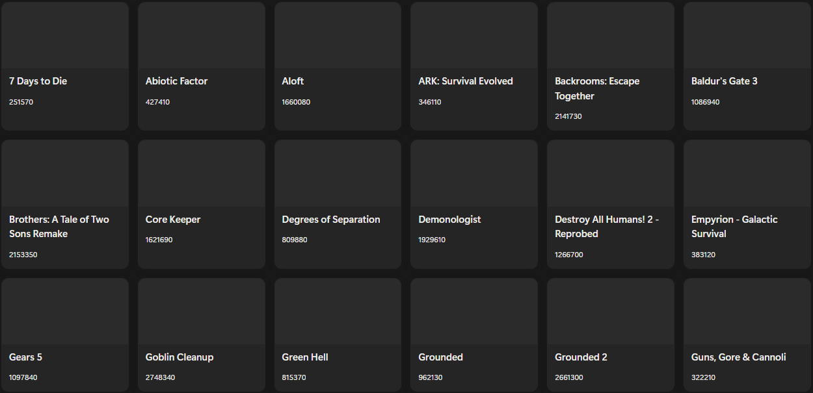

# User Manual

Team : Théo Pirouelle

<a href="https://www.python.org/">
  
</a>


---

## Preamble

To use the script, you'll need a Notion API key and a Notion database ID.
You'll need to create a `.env` file containing the variables `NOTION_TOKEN`, `NOTION_DATABASE_ID` and `RAWG_API_KEY` with your API key and database ID for the script to work correctly.

> [!IMPORTANT]
> To use the application, you need to be connected to the internet so that it can call the Steam and Notion APIs.

## Installation

> [!IMPORTANT]
> For the application to work properly, the `.env` file must be in the same place as the executable.

> [!NOTE]
> For information, the code has been developed and works with the following library versions:
> | Library | Version |
> | --- | --- |
> | requests | 2.32.5 |
> | pytest | 9.0.1 |

Please also remember to install Python. The code was developed and works with Python 3.11.

---

## Usage

In the Notion database configured in the `.env`, the following properties are required for the script to work:
- Platform (select): For the page to be processed, the selected platform must be ‘Steam’.
- ID (number): Similarly, for the page to be processed, there must be a game ID (or at least the game title as the page title).
- Released (checkbox)
- Release date (date)
- Genres (multi_select)
- Price (number)
- Estimated duration (number)
- Metacritic (number)

To easily find the game ID, simply go to the game's page in the Steam store and retrieve the ID from the page's URL.
For example, in the URL `https://store.steampowered.com/app/3097560/Liars_Bar/`, the game ID is `3097560`.

It is important to note that the estimated duration of a game is calculated in the script because there is no API that returns the real duration of a game. The value is therefore extracted from RAWG.io, and then, based on the tags and genres of the game, a multiplier ratio calculation is applied to this value.

To run the script in a Linux or PowerShell terminal:
```bash
python[3] [path/to/]export_data.py
```

The script will run and you should see the following lines displayed, for example:
```
🔍 Récupération Steam pour app_id = 1172620
📥 Données récupérées : {'app_id': 1172620, 'name': 'Sea of Thieves: 2025 Edition', 'price': 39.99, 'released': True, 'release_date': '2020-06-03', 'genres': ['Action', 'Adventure'], 'hltb_time': None, 'metacritic_score': None, 'cover_image': 'https://shared.akamai.steamstatic.com/store_item_assets/steam/apps/1172620/library_hero.jpg', 'icon_image': 'https://shared.akamai.steamstatic.com/store_item_assets/steam/apps/1172620/logo.png'}
✅ Page mise à jour : xxxxxxxxxxxxxxxx

🔍 Récupération Steam pour app_id = 1203180
📥 Données récupérées : {'app_id': 1203180, 'name': 'Breakwaters: Crystal Tides', 'price': 16.79, 'released': True, 'release_date': '2021-12-09', 'genres': ['Action', 'Adventure', 'Indie', 'Simulation', 'Early Access'], 'hltb_time': 13.2, 'metacritic_score': None, 'cover_image': 'https://shared.akamai.steamstatic.com/store_item_assets/steam/apps/1203180/library_hero.jpg', 'icon_image': 'https://shared.akamai.steamstatic.com/store_item_assets/steam/apps/1203180/logo.png'}
✅ Page mise à jour : xxxxxxxxxxxxxxxx

⏭️ Page ignorée (xxxxxxxxxxxxxxxx) — Platform = Epic Games

🔍 Récupération Steam pour app_id = 113200
📥 Données récupérées : {'app_id': 113200, 'name': 'The Binding of Isaac', 'price': 4.99, 'released': True, 'release_date': '2011-09-28', 'genres': ['Action', 'Adventure', 'Indie', 'RPG'], 'hltb_time': 10.0, 'metacritic_score': 84, 'cover_image': 'https://shared.akamai.steamstatic.com/store_item_assets/steam/apps/113200/library_hero.jpg', 'icon_image': 'https://shared.akamai.steamstatic.com/store_item_assets/steam/apps/113200/logo.png'}
✅ Page mise à jour : xxxxxxxxxxxxxxxx

[...]
```

---

## Result

Before:


After:

